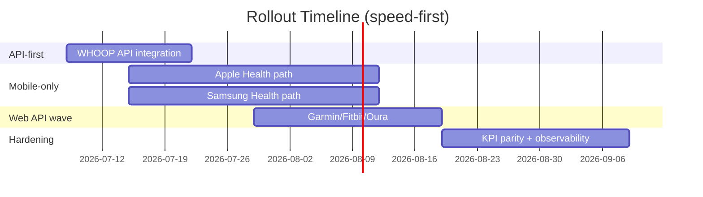
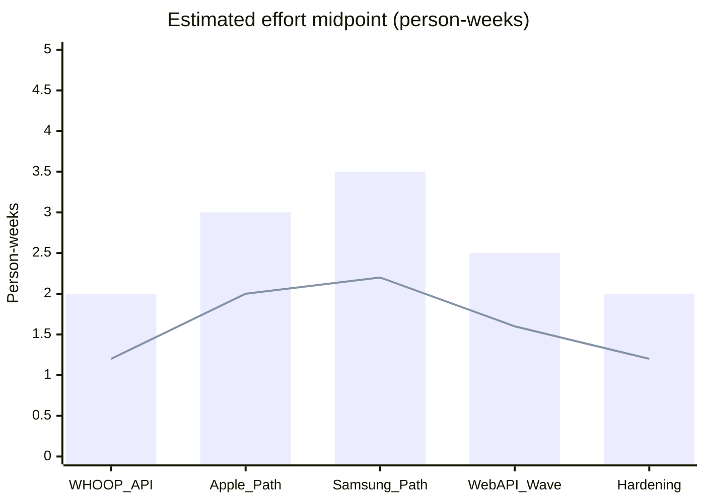

# Device Rollout Plan (WHOOP, Apple Watch, Samsung Watch, and others)

## Plain-language summary
We should connect **WHOOP API first**, then run **Apple Watch + Samsung Watch** in parallel, and then add Garmin/Fitbit/Oura.  
This gets value quickly while we build toward broader coverage.

---

## Prioritization model (speed-weighted)
1. **Speed to pilot impact** (highest)
2. **Low implementation/operational cost** (second)
3. KPI compatibility
4. Long-term optionality

## Rollout order
| Priority | Source | Why now | Integration path |
|---|---|---|---|
| P0 | **WHOOP API** | Existing pilot semantics, fastest measurable win | Terra Web API now, optional direct WHOOP later |
| P1 | **Apple Watch / Apple Health** | Highest likely BYOD adoption | Terra Mobile SDK (iOS) |
| P1 | **Samsung Watch / Samsung Health** | Strong Android healthcare/workforce share | Terra Mobile SDK (Android) |
| P2 | **Garmin** | Strong performance/workout data | Terra Web API |
| P2 | **Fitbit** | Broad mainstream user base | Terra Web API |
| P2 | **Oura** | Sleep/recovery depth | Terra Web API |
| P3 | **Withings** | Good body metrics, lighter workout depth | Terra Web API |
| P3 | **Polar** | High athletic data quality in specific segments | Terra Web API |

---

## KPI compatibility with pilot fields (with missing-field detail)

> **Note:** Match % values below are an internal estimate derived from mapping each provider's published field list against our 24-field pilot set. They are not vendor-published figures and have not yet been validated against live payloads — treat as directional until we run real accounts through each adapter.

### Pilot field set used for compatibility scoring
24 wearable-derived pilot fields:
- Wellness (15): recovery_score, hrv_ms, resting_hr, day_strain, calories, sleep_perf, sleep_hrs, sleep_debt, sleep_need, deep_sleep, rem_sleep, light_sleep, sleep_eff, sleep_consistency, resp_rate
- Additional wellness (2): blood_oxygen, skin_temp
- Workout (7): activity, duration_min, strain, max_hr, avg_hr, zone1_pct, zone2_pct

> Match % = fields directly available or high-confidence equivalent / 24

| Source | Match % | Typical missing/weak pilot fields |
|---|---:|---|
| **WHOOP API** | **100% (24/24)** | None material for current pilot |
| **Garmin** | **83% (20/24)** | recovery_score, sleep_debt, sleep_need, skin_temp |
| **Apple Health** | **75% (18/24)** | recovery_score, day_strain, sleep_debt, sleep_need, skin_temp, HR zone percentages |
| **Fitbit** | **75% (18/24)** | recovery_score, skin_temp, detailed HR zone fields, sleep_need |
| **Polar** | **75% (18/24)** | recovery_score, sleep_debt, sleep_need, skin_temp, some zone detail |
| **Samsung Health** | **67% (16/24)** | recovery_score, day_strain, sleep_debt, sleep_need, skin_temp, HR zone percentages, some workout strain semantics |
| **Oura** | **71% (17/24)** | activity strain semantics, full workout zone detail, some high-intensity workout fields |
| **Withings** | **46% (11/24)** | day_strain, workout strain, HR zones, many workout fields, sleep_need/debt |

---

## Derived/synthetic metric plan and quality
When direct fields are missing, we derive only where clinical/operationally reasonable.

| Metric needed in VOILoop | Derivation approach | Quality grade | Why |
|---|---|---|---|
| recovery_score | Weighted composite of sleep_perf, hrv trend z-score, resting_hr deviation, resp_rate deviation | **Medium** | Directionally useful; not WHOOP-equivalent physiology score |
| day_strain | Activity load model from duration, intensity zones, active calories | **Medium-Low** | Depends on provider intensity fidelity |
| sleep_need | 14-day baseline sleep duration + activity/stress adjustment | **Low-Medium** | Reasonable estimate, but not direct sensor-native metric |
| sleep_debt | `max(0, sleep_need - sleep_hrs)` | **Medium** if sleep_need exists; **Low-Medium** if sleep_need is synthetic | Formula is clear, quality inherits from sleep_need |
| workout strain | Convert MET/intensity/HR-load into normalized 0-21 style strain band | **Medium-Low** | Vendor strain scales differ materially |
| HR zones | Calculate zones from max_hr estimate and sampled HR | **Medium** | Reliable if HR cadence is good; weaker with sparse samples |

### Policy for synthetic metrics
1. Mark synthetic metrics explicitly in metadata.
2. Show confidence grade in downstream QA dashboards.
3. Avoid synthetic values for high-stakes clinical decisions unless validated.

---

## Mobile-only sources: what is required (technical + layperson)

### Layperson view
For Apple/Samsung, the phone is the bridge. The data lives with the user/device permissions, so we need app flows where the user says “yes,” then the phone sends allowed data.

### Technical requirements
1. **App surface**
   - iOS flow for Apple Health permissions
   - Android flow for Samsung Health permissions
2. **Terra Mobile SDK integration**
   - Session init, user link (`reference_id`), permission handoff
3. **Consent + legal**
   - Clear consent screens
   - Revocation handling and audit logging
4. **Identity linkage**
   - Stable mapping between VOILoop employee/user and Terra user_id
5. **Background delivery**
   - Handle intermittent connectivity
   - Queue/retry from app and backend webhook receiver
6. **Security**
   - Secure token handling, signed webhook verification, least-privilege scopes
7. **App operations**
   - iOS/Android release cadence, regression testing, crash/performance monitoring

### Android path detail: two SDK options, not one
Terra actually offers **two distinct backends** for Android, and we should pick a default rather than treat "Samsung Health path" as monolithic:

| Path | Access level | Requirement | Recommendation |
|---|---|---|---|
| **Health Connect** (via Terra Android SDK) | Broad — works on any Android 9+ device, Samsung Health data syncs into it automatically | No Samsung partnership needed; required by Google Play policy on Android 14+ | **Default/first path** — unblocks work immediately, widest device coverage |
| **Direct Samsung Health SDK** (via Terra Android SDK) | Most granular, Samsung-only | Requires applying for and being approved by Samsung's partner program (calendar-blocking, not just engineering effort); min Android 9 | Add later if Health Connect proves insufficient for specific fields |

Recommend starting with **Health Connect** as the default Android path so we aren't blocked on Samsung's approval timeline, and treat the direct SDK as a P2 enhancement.

### Ruled out: "bridge app" indirection (not a viable substitute)
It's technically possible to avoid building any native app by having users install a third-party bridge (e.g., Withings HealthMate, Health Sync, Strava via RunGap) that reads Apple Health/Samsung Health and forwards to *its own* cloud, which Terra then ingests via web API. **We are explicitly ruling this out** for the pilot:
- Field coverage shrinks to whatever the bridge app chooses to sync (no recovery/strain equivalents, inconsistent workout detail)
- Added sync latency and an extra vendor dependency outside our control
- Support burden shifts to "did the user configure the bridge correctly," which is worse UX than a first-party consent flow
- No SLA or webhook guarantees from the bridge vendor

This path is documented here only so it isn't rediscovered later and mistaken for a shortcut.

### Mobile-only effort detail (person-weeks)
| Work package | Cost estimate (person-weeks) | Notes |
|---|---:|---|
| iOS HealthKit + Terra SDK integration | 1.2-2.0 | Permissions, linking, local testing |
| Android Samsung Health + Terra SDK integration | 1.3-2.3 | Start with Health Connect path (no partner approval needed); direct Samsung SDK path adds calendar-blocking partner approval time on top, not just engineering hours |
| Backend mobile event ingestion + reconciliation | 1.0-1.8 | Shared with both platforms |
| Consent/revocation/audit controls | 0.7-1.0 | Legal + product workflow alignment |
| QA + release hardening | 1.0-1.7 | Device matrix + edge cases |
| **Total mobile-only track** | **5.2-8.8** | |

---

## Timeline + effort diagrams (mermaid)

---

## Go/no-go gates
1. Auth + identity linkage success rate >= 98% for activated users
2. Daily wellness freshness SLA met for active users
3. KPI parity checks within agreed tolerance by source
4. Incident rate and support load acceptable for pilot staffing

## Operational guardrails
- WHOOP workbook upload remains pilot fallback only
- Feature flags per source
- Source-specific freshness + failure dashboards
- Weekly parity review of synthetic metrics vs direct metrics
