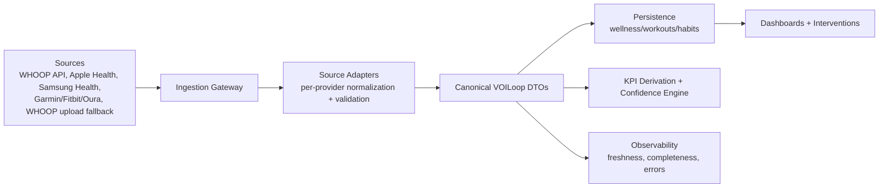
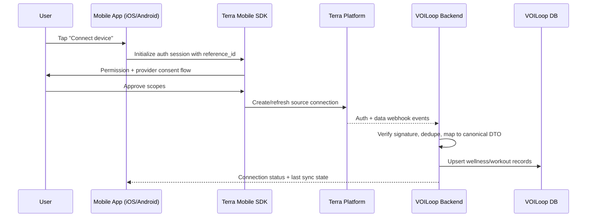

# Integration Architecture Options (with mobile-only source detail)

## Plain-language summary
We should build VOILoop like a **universal power adapter**:
- Different devices plug in different ways
- We convert each one to a common internal format
- Dashboards and KPIs read one stable format

This keeps us fast now and flexible later.

---

## Current baseline
- Ingestion today is WHOOP workbook-centric (`src/lib/whoop/*`).
- Storage already supports normalized records (`daily_wellness`, `workouts`, `habits`).
- Main gap is source adapters and mobile-only flows.

---

## Recommended architecture (hybrid boundary)

## Why this is the right shape
- Lets us onboard sources quickly (speed)
- Contains vendor-specific complexity in adapters (low long-term maintenance)
- Supports switching acquisition providers later without rewriting KPI logic

---

## Option comparison
| Option | Layperson view | Pros | Cons | Fit |
|---|---|---|---|---|
| Direct-only | Build every connector ourselves now | Full control | Slowest and most expensive to start | Poor for pilot speed |
| Terra-only forever | Outsource all integrations long-term | Fastest initial launch | Highest lock-in + external dependency | Risky long-term default |
| **Terra-now + hybrid boundary** | Use Terra now, keep exit path | Fast and still flexible | Needs adapter discipline | **Recommended** |

---

## Mobile-only sources (Apple/Samsung): end-to-end detail

> **Scope note:** the Terra Widget (hosted auth flow) removes integration work for **web-API sources only** (WHOOP, Garmin, Fitbit, Oura, Withings, Polar). It does **not** apply to Apple Health or Samsung Health — those remain mobile-SDK-only regardless of widget usage, because Apple/Samsung expose no server-side API at all. Any future reference to "just use the widget" should not be read as covering these two sources.

### Layperson workflow
1. User opens mobile app.
2. User grants health-data permission.
3. Phone reads permitted data.
4. Data is sent through Terra/backend.
5. VOILoop normalizes and updates KPIs.

### Technical workflow

### Technical requirements checklist
1. iOS + Android app integration surfaces
2. Terra SDK auth initialization and callback handling
3. Stable user linking (`reference_id` -> VOILoop user/employee)
4. Consent auditing + revocation processing
5. Signed webhook verification + idempotency
6. Reconciliation jobs for missed events
7. Device/platform QA matrix and release process

### Android: Health Connect vs direct Samsung Health SDK
Terra's Android SDK supports two backends and we should be explicit about which we build against first:
- **Health Connect** (recommended default): works across all Android 9+ devices, no Samsung partnership required, and is the path Google Play policy increasingly expects on Android 14+. Samsung Health data syncs into Health Connect automatically.
- **Direct Samsung Health SDK**: most granular Samsung-specific data, but requires applying for and being approved through Samsung's partner program — a calendar dependency, not just an engineering task. Treat as a P2 enhancement once Health Connect is live.

### Ruled out: bridge-app indirection
A chain like Apple Health → Health Sync/Withings HealthMate → vendor cloud → Terra web API is technically possible without building a native app, but is explicitly out of scope: field coverage is limited to what the bridge forwards, latency is uncontrolled, and support complexity increases. Documented here so it isn't proposed later as a shortcut.

### Common failure modes (and controls)
| Failure mode | Business impact | Control |
|---|---|---|
| User denies permissions | Missing data | Guided re-consent UX + status messaging |
| Webhook missed/delayed | KPI staleness | Reconciliation polling + freshness alerts |
| Duplicate events | Double counting | Idempotency keys + upsert rules |
| Identity mismatch | Wrong-user data assignment | Strict mapping constraints + audit checks |
| Token/refresh race | Data gaps | Serialized refresh + retry backoff |

---

## Canonical DTO contract
Each adapter must output:
1. Canonical payload (`CanonicalDailyWellness`, `CanonicalWorkout`, `CanonicalHabitSignals`)
2. Metadata (`source`, `source_record_id`, `recorded_at`, `ingested_at`)
3. Quality fields (`field_completeness_pct`, `mapping_confidence`)
4. `synthetic_fields[]` list for derived metrics

---

## KPI derivation and quality policy
- **Direct** metric: native equivalent field exists (highest trust)
- **Derived** metric: mathematically inferred from related fields (medium trust)
- **Unavailable** metric: remain null, don’t fake precision (safest)

| Mapping type | Quality floor | UI behavior |
|---|---|---|
| Direct | High | Use in KPI and intervention logic |
| Derived | Medium (or Medium-Low) | Use with confidence label + source note |
| Unavailable | N/A | Show “not available for this source” |

---

## Implementation sequence
1. Create `src/lib/integrations/` interfaces and provider registry
2. Refactor WHOOP upload path to canonical DTO output
3. Add WHOOP API path (first-class source)
4. Add Apple/Samsung mobile-only flow support
5. Add Garmin/Fitbit/Oura adapters
6. Add confidence/freshness observability and parity dashboards

---

## Exit strategy (if Terra is temporary for some sources)
Swap only the **source client** while preserving:
- Adapter contracts
- Canonical DTOs
- Persistence schema
- KPI derivation logic

In plain language: we can change the “input plug” without replacing the rest of the electrical system.
