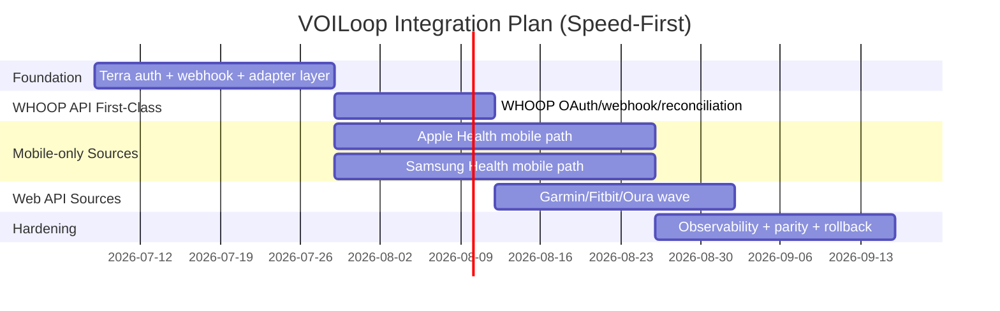
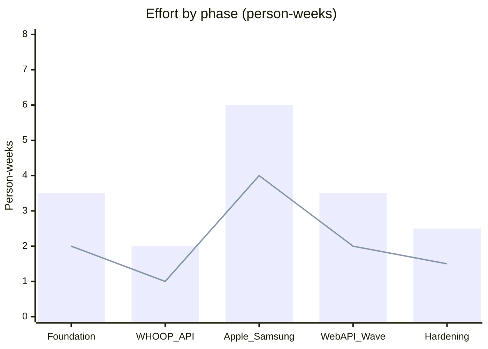

# Terra API vs Build Ourselves: Recommendation for VOILoop

## Executive answer
Use **Terra for 3-4 months** to move fast in pilot, while we build our own provider-agnostic integration layer behind it.

In plain language: Terra is the fastest way to get many devices connected quickly. We should use that speed now, but structure the code so we can later keep Terra only where it still makes business sense.

---

## The “critical nuance” (layperson explanation)
**Nuance:** Terra can unify many device APIs, but **Apple Health and Samsung Health are mobile-only data sources**.

### What that means in practice
- You **cannot** pull Apple/Samsung health data from a backend server alone — Apple and Samsung publish no server-side API for this data.
- We must have a **mobile SDK integration on a phone** — this can be our own app, or the Terra SDK embedded via React Native/Flutter/Capacitor into an existing app shell, but a native mobile runtime is required either way.
- The phone collects user-permitted data and sends it through Terra/our backend.
- The Terra hosted **Widget** (which removes work for web-API sources like Fitbit/Garmin/Oura) does **not** eliminate this requirement for Apple/Samsung.
- A "bridge app" workaround (e.g., routing Apple Health through Withings HealthMate or Health Sync to another vendor's cloud) is technically possible but explicitly not recommended — it drops field coverage, adds latency, and depends on a vendor we don't control.

### Why this matters
- Buying Terra does **not** remove mobile app work for Apple/Samsung.
- Terra still helps by standardizing data and auth patterns, but we must budget mobile engineering.

---

## Updated decision weighting (speed first)
We are intentionally optimizing for:
1. **Speed to pilot value** (highest)
2. **Low implementation + operating cost** (second highest)
3. Data fit
4. Lock-in risk

### Weighted score model
- Speed to value: **45%**
- Implementation + operations cost: **30%**
- KPI data fit: **15%**
- Lock-in/manageability: **10%**

| Option | Speed (45%) | Cost (30%) | Data fit (15%) | Lock-in (10%) | Weighted total | Rank |
|---|---:|---:|---:|---:|---:|---:|
| Direct-only build | 2 | 2 | 5 | 5 | **2.75 / 5** | 3 |
| Terra-only long term | 5 | 4 | 4 | 2 | **4.25 / 5** | 2 |
| **Terra now + planned hybrid exit** | 5 | 4 | 4 | 4 | **4.45 / 5** | **1** |

**Recommendation:** Terra-now + hybrid-exit still wins under speed-first weighting.

---

## WHOOP deep research summary (official docs/OpenAPI)
WHOOP is integration-ready and should be treated as a first-class API source, not upload-only.

### Confirmed from WHOOP docs/OpenAPI
- OAuth 2.0 auth/token endpoints:
  - `https://api.prod.whoop.com/oauth/oauth2/auth`
  - `https://api.prod.whoop.com/oauth/oauth2/token`
- Base API server:
  - `https://api.prod.whoop.com/developer`
- Confirmed v2 data endpoints:
  - `/v2/recovery`, `/v2/cycle`, `/v2/cycle/{cycleId}/recovery`
  - `/v2/activity/sleep`, `/v2/activity/workout`
  - `/v2/user/profile/basic`, `/v2/user/measurement/body`
- Scopes:
  - `read:recovery`, `read:cycles`, `read:workout`, `read:sleep`, `read:profile`, `read:body_measurement`
- Rate limits (default):
  - 100 requests/min
  - 10,000 requests/day
- Webhooks:
  - Event-based notifications (sleep/workout/recovery updated/deleted)
  - Signature validation required
  - WHOOP's public docs state retries are **finite, not indefinite**, but do **not** publish an exact retry count or interval — treat any specific number (e.g., "5 retries over ~1 hour") as unverified until confirmed directly with WHOOP support. Design for **at-least-once, possibly-delayed delivery** regardless: reconciliation polling via `/v2/*` endpoints is required, not optional.

---

## Terra monthly cost model (explicit)
Terra pricing docs define a credit model:
- 100,000 credits included monthly in subscription
- 100,001 to 1,000,000 credits: **$0.005 / credit**
- 1,000,001+ credits: **$0.003 / credit**
- 200 credits per active authentication per month
- First 400 events per active auth included, then 0.5 credits/event

> **Correction:** Terra *does* publish a base subscription price — the **"Quick Start" plan is $499/month** (per tryterra.co/pricing) and includes the 100,000 credits above. Larger/enterprise plans are contract-dependent and may have a different (likely higher) base with different included-credit amounts; confirm current contract terms before finalizing budget. The scenario table below was previously mislabeled as complete monthly cost — it is **overage only**. Total monthly cost = **$499 (or contracted base) + overage**.

### Formula
- `AuthCredits = ActiveAuth * 200`
- `EventCredits = max(0, (EventsPerAuth - 400) * ActiveAuth * 0.5)`
- `TotalCredits = AuthCredits + EventCredits`
- `OverageCredits = max(0, TotalCredits - 100000)`
- `OverageCost = min(OverageCredits, 900000) * 0.005 + max(0, OverageCredits - 900000) * 0.003`
- `TotalMonthlyCost = $499 base + OverageCost` (assuming Quick Start plan)

### Monthly overage scenarios (base fee excluded — see corrected total column)
| Scenario | Active auths | Events per auth / month | Total credits | Overage credits | Overage cost / month | **Total incl. $499 base** |
|---|---:|---:|---:|---:|---:|---:|
| Small pilot | 100 | 300 | 20,000 | 0 | **$0** | **$499** |
| Pilot growth | 250 | 600 | 75,000 | 0 | **$0** | **$499** |
| Mid rollout | 400 | 800 | 160,000 | 60,000 | **$300** | **$799** |
| Large pilot | 1,000 | 900 | 450,000 | 350,000 | **$1,750** | **$2,249** |
| Multi-site scale | 3,000 | 1,200 | 1,800,000 | 1,700,000 | **$6,900** | **$7,399** |

---

## Implementation timeline + effort (mermaid)

- **Bars** = human-only midpoint
- **Line** = human+agentic midpoint

---

## What Terra gives us vs what we still own
| Area | Terra gives | VOILoop still owns |
|---|---|---|
| Provider auth | Standardized auth/session flows | User identity linking + account lifecycle |
| Data events | Webhook/event delivery | Idempotency, retries, reconciliation jobs |
| Normalization | Cross-provider baseline format | VOILoop KPI mapping, quality controls |
| Compliance tooling | Vendor controls and certifications | End-to-end app governance and risk controls |
| Apple/Samsung | SDK path and abstraction | Mobile implementation and app release work |

---

## Final recommendation
**Buy Terra now for speed**, keep WHOOP API as first-class immediately, and run Apple/Samsung mobile tracks in parallel.  
Architect for a hybrid future so we preserve the option to move select high-volume connectors to direct integrations later.
